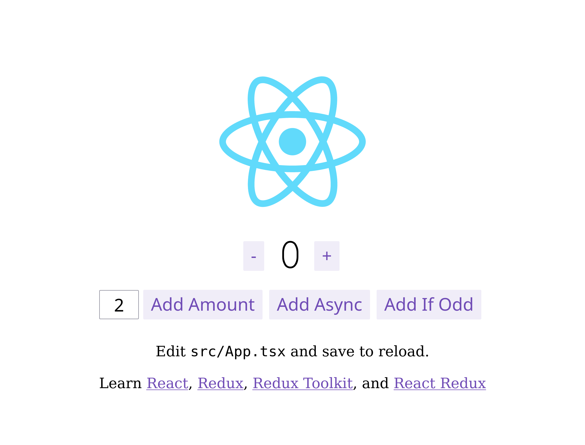

# 🔬 Redux Clean Architecture Examples

[](./LICENSE)

> Experiments to test redux-clean-architecture library

Examples:

**TodoMVC**


**Counter**



## Run Locally

Clone the project

```bash
  git clone https://github.com/leosuncin/redux-clean-example.git
```

Go to the project directory

```bash
  cd redux-clean-example
```

Install dependencies

```bash
  pnpm install
```

Start the server

```bash
  pnpm dev
```

## Running Tests

To run unit tests, run the following command:

```bash
  pnpm test
```

## License

Release under the terms of [MIT](./LICENSE)
